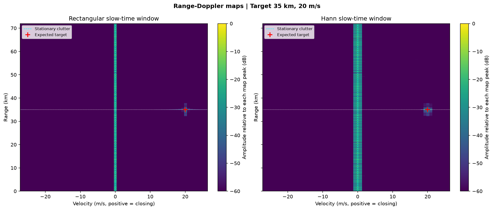
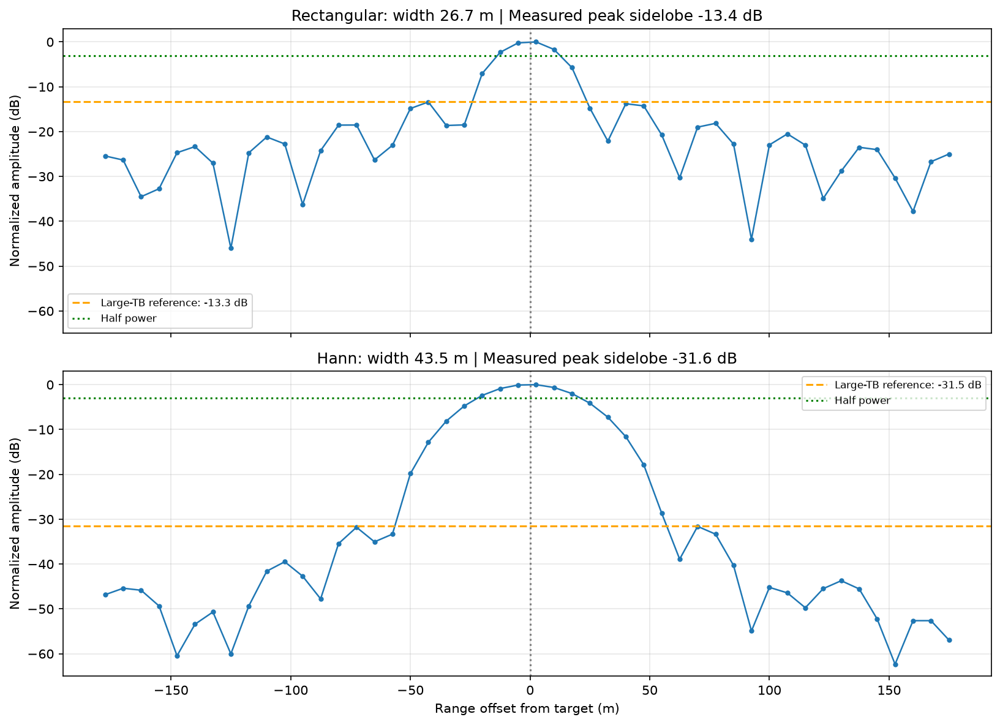
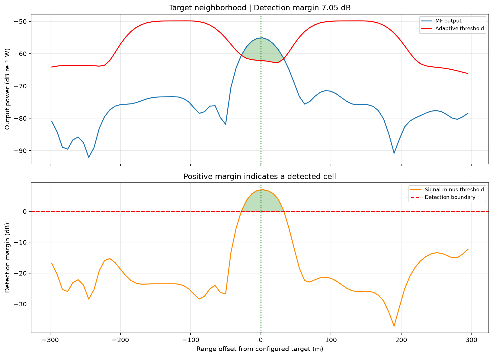

# LFM Radar Simulation

A Python simulation of a monostatic linear frequency-modulated (LFM) pulse radar, from complex baseband signal generation to range compression, range-Doppler processing, and adaptive CA-CFAR detection.

The repository contains five runnable examples, shared numerical routines, and regression tests. Comments, console output, and plot labels are in English.



## What it demonstrates

1. **Signal modeling:** causal LFM transmission/echo timing, radar-equation power, Gaussian noise, and a Swerling-0 detection-probability curve.
2. **Clutter generation:** Weibull inverse-CDF sampling, moment validation, and equal-power shape comparisons.
3. **Pulse compression:** FFT-based linear correlation, rectangular versus Hann weighting, measured main-lobe widths, and sidelobe levels.
4. **Range-Doppler processing:** a 64-pulse coherent processing interval, slow-time windowing, and velocity aliasing.
5. **CA-CFAR detection:** local power estimation, guard/reference cells, adaptive thresholds, and detection margins.

## Quick start

Use **Python 3.10 or newer**. Run these commands from a terminal:

```bash
git clone https://github.com/MBerkKellecioglu/lfm-radar-simulation.git
cd lfm-radar-simulation
python3 -m venv .venv
source .venv/bin/activate
python -m pip install -r requirements.txt
python run_all.py --no-show
```

On Windows, use `python` in place of `python3` and activate with `.venv\Scripts\activate` in Command Prompt, or `.venv\Scripts\Activate.ps1` in PowerShell.

The command generates **nine PNG figures** in `figures/` and prints numerical summaries. Omit `--no-show` to open interactive plot windows. To run one part or choose an output directory:

```bash
python part3_pulse_compression.py --no-show
python part5_ca_cfar.py --no-show --output-dir figures/cfar
python -m unittest discover -s tests -v
```

Each script is safe to import: simulation and plotting start only when its `main()` function is called or the script is executed. Random generators use fixed seeds for reproducible examples.

## Repository layout

```text
lfm-radar-simulation/
├── part1_signal_modeling.py
├── part2_clutter_generation.py
├── part3_pulse_compression.py
├── part4_range_doppler.py
├── part5_ca_cfar.py
├── radar_utils.py                 # Shared parameters and processing functions
├── run_all.py                     # Run all five examples
├── requirements.txt
├── tests/test_radar.py
└── docs/images/                   # Selected reproducible figures for this README
```

Edit the common scenario parameters in `radar_utils.py` before running the scripts. Pulse count is configured in `part4_range_doppler.py`; CFAR reference/guard counts are configured in `part5_ca_cfar.py`. Derived quantities are calculated when modules are imported, so restart the process after changing parameters.

## Default scenario

| Parameter | Value |
| --- | --- |
| Carrier frequency | 5.6 GHz |
| LFM bandwidth | 5 MHz |
| Pulse duration | 20 us |
| Transmit peak power | 1.5 MW |
| Antenna gain (Tx and Rx) | 45 dB |
| Noise figure / system loss | 1.5 dB / 3 dB |
| PRF / sampling rate | 2 kHz / 20 MHz |
| Target range / radial velocity | 35 km / +20 m/s |
| Target RCS | 0.1 m² (-10 dBsm), Swerling 0 |
| Clutter shape / sampled-input CNR | Weibull shape 2 / 30 dB |
| Pulses per CPI | 64 (32 ms) |
| CFAR reference / guard cells | 16 / 8 **per side** |
| Nominal CFAR false-alarm probability | 10⁻⁶ per cell |

Positive radial velocity means **closing** motion and positive Doppler throughout this code.

## Example results

These results were produced by the default seeded run with Python 3.12, NumPy 2.3.5, SciPy 1.18.1, and Matplotlib 3.11.2. Small differences may occur across numerical-library versions.

| Quantity | Result |
| --- | --- |
| Nominal range resolution, c/(2B) | 30 m |
| Range sample spacing, c/(2fs) | 7.5 m |
| Time-bandwidth product | 100 (20 dB) |
| Ideal thermal-noise matched-filter SNR | 54.09 dB |
| Required SNR for PD=0.8, Pfa=10⁻⁶, Swerling 0 | 12.57 dB |
| Sampled thermal-noise matched-filter SNR | 53.95 dB |
| Rectangular / Hann half-power width | 26.72 / 43.52 m |
| Rectangular / Hann peak sidelobe | -13.39 / -31.59 dB |
| Doppler-bin spacing | 0.8371 m/s |
| Unambiguous velocity interval | [-26.786, +26.786) m/s |
| Apparent velocity for a -30 m/s target | +23.571 m/s; nearest measured bin +23.438 m/s |
| Detected target range | 35.0025 km |
| Target-associated CFAR detection margin | 7.05 dB |

The 2.5 m range error in this realization is **not** 2.5 m range resolution. Resolution, sample spacing, and estimation error describe different properties. Similarly, Doppler-bin spacing alone does not determine minimum detectable velocity.

### Pulse compression and windowing



The reference chirp starts at the same local time as the echo. Linear correlation uses enough FFT padding to prevent circular wraparound and returns only lags with complete reference overlap. Half-power widths are interpolated between samples; sidelobes are measured outside the nearest main-lobe minima. Hann weighting broadens the main lobe and has an ideal aligned-pulse SNR loss of approximately 1.77 dB.

### Adaptive detection



CA-CFAR averages the **power** in 32 reference cells, excluding eight guard cells on each side of the CUT. The multiplier is:

```text
alpha = N * (Pfa^(-1/N) - 1),  N = 32
threshold = alpha * mean(reference-cell power)
detection = CUT power > threshold
```

Cells lacking a full training window have undefined (`NaN`) thresholds and cannot trigger detections. The strongest detection inside a ±60 m association gate is reported as the target detection. Multiple detected cells can belong to one echo; target clustering is not implemented. Empty detection sets are handled explicitly.

## Modeling conventions and limits

- **Power normalization:** complex envelopes satisfy `E[abs(x)**2] = power`. Target amplitude is `sqrt(Pr)`. IID noise at sampling rate `fs` has variance `k_B*T0*F*fs`; `Pn_band = k_B*T0*F*B` is reported separately. This keeps sampled matched-filter SNR consistent with the radar equation. CNR is defined relative to the total sampled-input noise variance.
- **Chirp and timing:** the causal pulse has local phase `pi*k_r*(t-tau_p/2)^2` for `0 <= t < tau_p`, sweeping approximately from `-B/2` to `+B/2`. Echo delay is modeled continuously and sampled without rounding it to an integer delay first.
- **Range limits:** the ambiguity limit is 75 km. The full echo must fit before the next pulse, giving a 72 km limit for these scripts. The nominal transmit/receive blanking distance is 3 km; a detailed duplexer/receiver blanking model is not simulated.
- **Clutter:** independent Weibull amplitudes with uniform random phases form a simplified statistical background. Shape 2 gives circular Gaussian complex samples and a Rayleigh envelope. Part 4 repeats the same clutter realization across pulses, imposing exactly zero clutter Doppler before slow-time windowing. Terrain geometry, spatial correlation, and clutter Doppler spread are not modeled.
- **Motion:** target range and amplitude remain constant during each CPI; within-pulse and pulse-to-pulse Doppler phase are included. Range migration, acceleration, multipath, and fluctuating RCS are not modeled.
- **SNR and PD:** the ideal Swerling-0 curve concerns a single pulse in Gaussian noise with a known background. Its SNR margin excludes clutter, window weighting loss, and CFAR loss.
- **CFAR calibration:** the analytic multiplier assumes independent, identically distributed exponential power samples. Matched filtering and oversampling correlate neighboring cells. Therefore the requested `Pfa=1e-6` is a **nominal setting**, not an empirically established false-alarm rate for this processing chain. Heavy-tailed clutter, clutter edges, and additional targets can further change detection behavior. See the [CFAR detector assumptions](https://www.mathworks.com/help/phased/ref/phased.cfardetector-system-object.html).
- **Processing scope:** Part 5 performs 1-D CFAR on a single-pulse range profile. It is not a 2-D detector applied to Part 4's range-Doppler map.

## Validation

The 12 regression tests check linear correlation against a direct implementation, range alignment at multiple distances, SNR normalization, noise/clutter power, the Hann trade-off, target Doppler and aliasing, explicit CFAR reference windows, invalid/short inputs, absent-target behavior, and detection-probability limits.

A separate test measures the CFAR false-alarm rate on one million **IID exponential** power samples at `Pfa=1e-3`. This is a quick analytic-baseline check; it does not validate the complete correlated radar chain at `Pfa=1e-6`.

Regenerate the README images from the same scripts with:

```bash
python part3_pulse_compression.py --no-show --output-dir docs/images
python part4_range_doppler.py --no-show --output-dir docs/images
python part5_ca_cfar.py --no-show --output-dir docs/images
```
